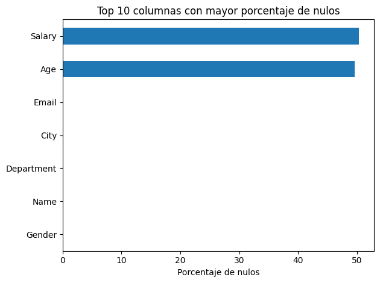

# Limpieza y Validación de un Dataset con Errores Reales


## Contenido

- [Dataset](#dataset)
- [Proceso](#proceso)
- [Hallazgos principales](#hallazgos-principales)
- [Herramientas](#herramientas)
- [Estructura del repositorio](#estructura-del-repositorio)

**Pregunta:** partiendo de un dataset crudo con errores y ~50% de valores faltantes, ¿qué se puede limpiar con seguridad, qué se debe dejar como nulo, y cómo se prueba que la limpieza no introdujo distorsión?

**Resultado en una frase:** se documentaron y justificaron todas las decisiones de limpieza (texto estandarizado, 0 duplicados, nulos conservados en vez de imputados a ciegas), con validación antes/después de que no se perdieron filas ni columnas.

Partir de un dataset crudo con errores y valores faltantes, diagnosticar problemas de calidad, limpiar con decisiones documentadas y justificadas, validar con controles antes/después, y comunicar hallazgos con gráficos.

> El objetivo de este proyecto no es "borrar datos rápido" — es demostrar el proceso completo: detectar, decidir, justificar, limpiar y validar, con evidencia en cada paso.

---

## Dataset

**Cleaning Practice with Errors & Missing Values** — [Kaggle](https://www.kaggle.com/datasets/zuhairkhan13/cleaning-practice-with-errors-and-missing-values). 500 filas × 7 columnas (Name, Gender, Age, City, Department, Salary, Email).

## Proceso

1. **Auditoría inicial**: estructura, tipos de datos, nulos y duplicados por columna.
2. **Bitácora de calidad**: cada problema encontrado documentado con evidencia y decisión propuesta (eliminar / imputar / estandarizar / conservar).
3. **Limpieza reproducible**: nombres de columnas, texto inconsistente, tipos numéricos mal interpretados, duplicados exactos.
4. **`pd.concat()` obligatorio**: el dataset se divide en dos lotes simulados y se reconstruye, con validación de que no se perdieron filas.
5. **`groupby()`**: resumen por categoría (conteo, promedio, mediana, min/max).
6. **4 gráficos con interpretación escrita** (nulos, distribución, conteo por categoría, promedio por categoría).
7. **Validación final** antes/después (filas, columnas, duplicados, nulos).

## Hallazgos principales



- ~50% de nulos en las columnas numéricas (`Age`, `Salary`) — se conservaron como nulo en lugar de imputar, porque imputar con ese nivel de faltantes distorsionaría la distribución real.
- 0 duplicados exactos en el dataset.
- Departamento "RH" concentra más registros; salarios promedio similares entre departamentos, con "HR" ligeramente arriba y "Ventas" ligeramente abajo.

## Herramientas

Python (pandas, NumPy) · Matplotlib/Seaborn

## Estructura del repositorio

```
├── README.md
├── requirements.txt                              # Dependencias Python (pip install -r requirements.txt)
├── limpieza_validacion_datos.ipynb              # Notebook completo (7 partes: diagnóstico → limpieza → validación)
├── data_cleaning_practice_dataset.csv           # Dataset crudo original
├── dataset_limpio.csv                           # Dataset limpio exportado
├── resumen_groupby.csv                          # Tabla resumen por categoría
├── reporte_decisiones_limpieza.docx             # Reporte corto de decisiones (1-2 páginas)
└── results/                                      # Gráficos exportados del notebook
    ├── limpieza_01.png
    ├── limpieza_02.png
    ├── limpieza_03.png
    └── limpieza_04.png
```

## Autora

Karina Correa — [LinkedIn](https://linkedin.com/in/karina-correa-aparicio) · [GitHub](https://github.com/KARCOR)
